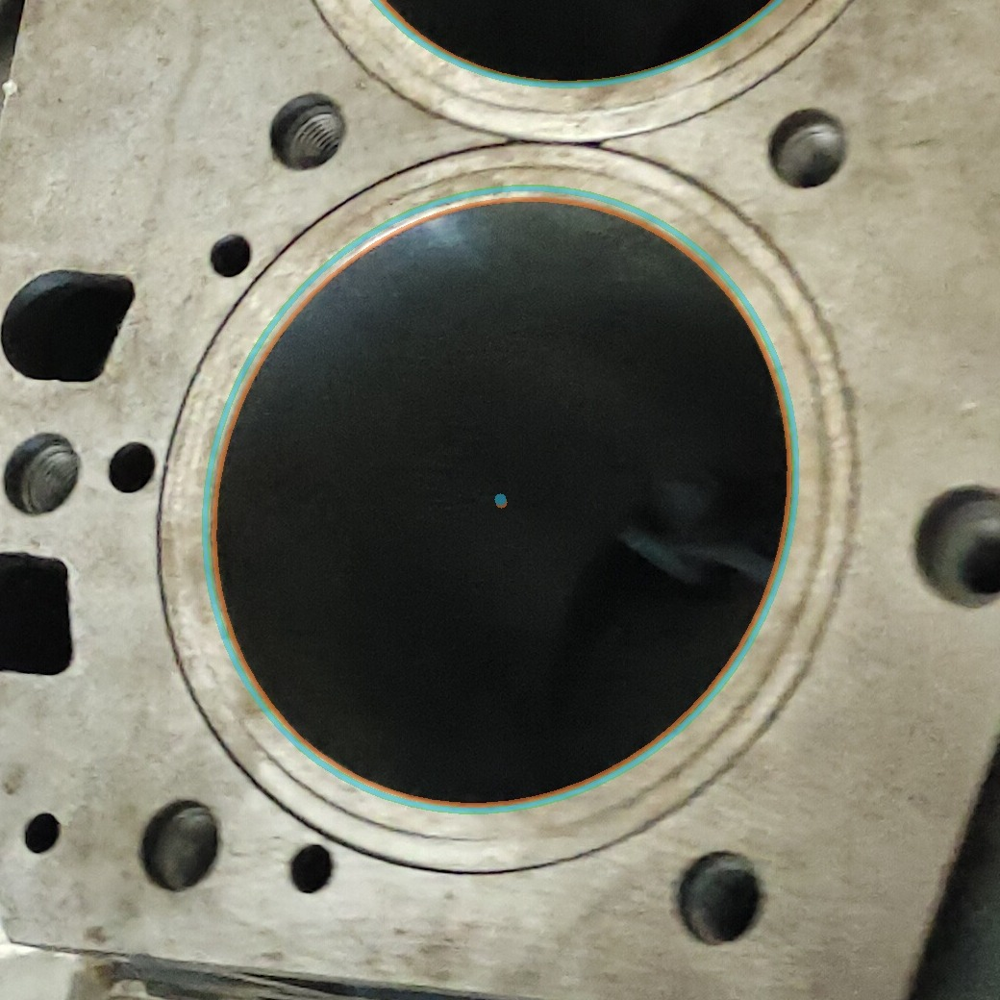
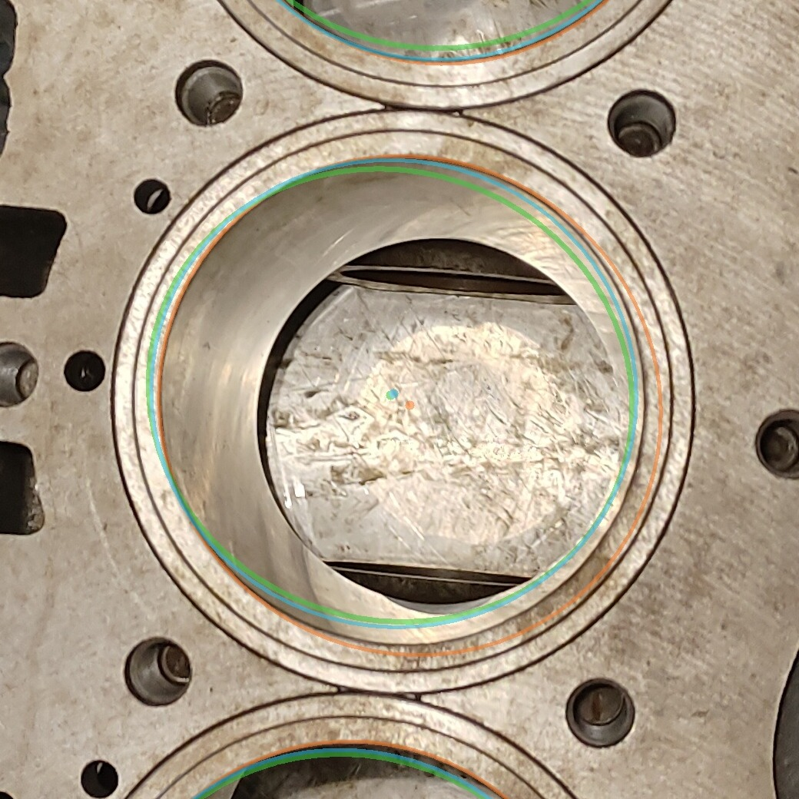

# 椭圆拟合方式对比与采纳记录

日期：2026-10-07　　脚本：`scripts/compare_ellipse_fit.py`
数据：本项目自带 `test_images` 4 张，`conf=0.15`（为了把反光孔也纳入对比），`imgsz=640`，共 **16 个孔**
结果：`results/ellipse_fit_comparison/comparison.json`、`summary.md`、`*_overlay.jpg`

---

## 一、三种方法

| 代号 | 方法 | 来源 |
| --- | --- | --- |
| **A** | `cv2.fitEllipse(mask 轮廓)` | 本项目原有做法（`app/vision.py`） |
| **B** | `robust_bore_ellipse()`：RANSAC + 内点重拟合 | 朋友 `feature/fusion` 分支 |
| **C** | B + `refine_multi_edge()`：沿法线做亚像素孔口边缘搜索 | 同上 |

---

## 二、实测结果（16 个孔）

| 指标 | A 现有 | B 稳健 | C 稳健+边缘精修 |
| --- | ---: | ---: | ---: |
| 成功孔数 | 16/16 | 16/16 | 16/16 |
| 中位残差（到 mask 轮廓，px） | 2.08 | 1.98 | 6.28 *（见下）* |
| 平均支持率（轮廓点在容差内） | 0.967 | 0.963 | 0.813 *（见下）* |
| 稳定性：截断 80% 轮廓后圆心最大漂移（中位，px） | 2.51 | 3.31 | — *（用他自带指标）* |
| 他内置的自助抽样稳定性（中位，px） | — | — | **0.10**（允许上限 1.0） |
| **边缘梯度中位（p50）** | 4.38 | 4.58 | **16.58**（3.8 倍） |
| **边缘梯度 25% 分位（p25）** | 1.92 | 2.05 | **13.34**（7.0 倍） |
| 单孔耗时 | < 1 ms | 32 ms | 60 ms |

**为什么 C 的"到 mask 残差"更大不是缺点**：C 的设计目标就是**离开 mask 边界**、
贴到真实强度边缘上。用 mask 轮廓当基准评价 C，等于用错误答案给它打分。

**为什么"边缘梯度"才是关键指标**：真正的孔口边缘就是图像里的强梯度带。
一个椭圆如果整圈都压在强梯度上，说明它贴着真实孔口；如果只有局部压到，
说明它一部分走在没有边缘的地方（也就是"看着不对"的那种椭圆）。

---

## 三、肉眼验证（决定性证据）

`results/ellipse_fit_comparison/` 里有放大裁图（绿=A，青=B，橙=C）：

| 图 | 现象 |
| --- | --- |
|  | 绿/青几乎重合，停在**外圈倒角**上；橙贴在内侧"亮环→暗孔"的过渡处，即真实孔口 |
|  | （反光孔，conf=0.172）绿/青停在外圈倒角并且**明显不圆**；橙是一条**干净的圆**，精确贴合缸孔内壁 |

也就是说：

> 之前"孔看着是椭圆的、拟合不好"，根本原因不是椭圆算法差，
> 而是 **YOLO 的 mask 边界并不等于物理孔口**（mask 会跟着倒角/反光走），
> `cv2.fitEllipse` 忠实拟合了这条不规则的 mask 边界，于是把它的不规则也一起继承下来了。

---

## 四、结论与采纳

**采纳 C（`robust_edge`）作为默认拟合方式**，理由是三项同时成立：

1. 边缘贴合度显著更高（p25：13.34 vs 1.92，**7 倍**）；
2. 稳定性更好（他内置指标 0.06–0.32 px，全部远低于 1 px 门槛；A 在同一测试下漂移 1.5–13.7 px）；
3. 代价可接受（+60 ms/孔，4 孔约 +0.24 s/张；实测整张图 0.5–0.7 s）。

实现位置：

```
app/config.py    ELLIPSE_FIT_MODE = "robust_edge"   # "current" / "robust" / "robust_edge"
app/vision.py    fit_ellipse_ex(contour, image, mode)  -> 自动退回上一级，永不抛错
app/robust_bore_ellipse.py      (来自 feature/fusion，逐字节一致)
app/edge_bore_refinement.py     (来自 feature/fusion，逐字节一致)
```

每个孔的拟合过程都会写进结果：`hole["ellipse_fit"] = {"requested", "used", ...}`，
`used` 会是 `current` / `robust` / `robust_edge` 之一 —— **如果边缘精修被拒绝，
它会退回 `robust` 或 `current` 并说明原因，不会硬套一个不可靠的椭圆。**

**想回到原来的拟合方式**：把 `app/config.py` 里那行改成 `"current"` 即可（一行，随时可逆）。

---

## 五、验证与限制（必须如实说明）

已验证：

- 检测数量**完全没变**：测试1/2/4 = 4/4，测试3 = 3/4（`conf=0.50`）
- `app/selftest_full.py` **73/73 通过**；`selftest_coldstart.py` PASS
- 16/16 个孔都成功给出了 `robust_edge` 结果，没有回退

限制：

1. **没有人工标注的孔口真值**，所以"更贴合真实孔口"是**基于图像梯度与目视**的判断，
   不是量化的圆心误差（要量化必须人工标注多边形后再算）。
2. C 在反光孔上最大移动了 **26 px**（测试3 H02）。看放大图这一移动是**正确**的
   （从倒角移到缸孔内壁），但这也说明：在这种孔上，A/B/C 的圆心可以差到两位数像素，
   **谁在"倒角外圈"、谁在"缸孔内壁"，必须在标定时定义清楚**，否则像素→机器人坐标
   的转换会因为"用的是哪个圆"而系统性偏掉。
3. 只用了本项目 4 张图（同一箱体、有限视角）。换箱体/换相机后需重新确认。

---

## 六、复现命令

```bat
E:\robot_project\robot_inspection\.venv\Scripts\python.exe E:\robot_project\robot_inspection\scripts\compare_ellipse_fit.py
E:\robot_project\robot_inspection\.venv\Scripts\python.exe E:\robot_project\robot_inspection\scripts\compare_ellipse_fit.py --conf 0.5
```
